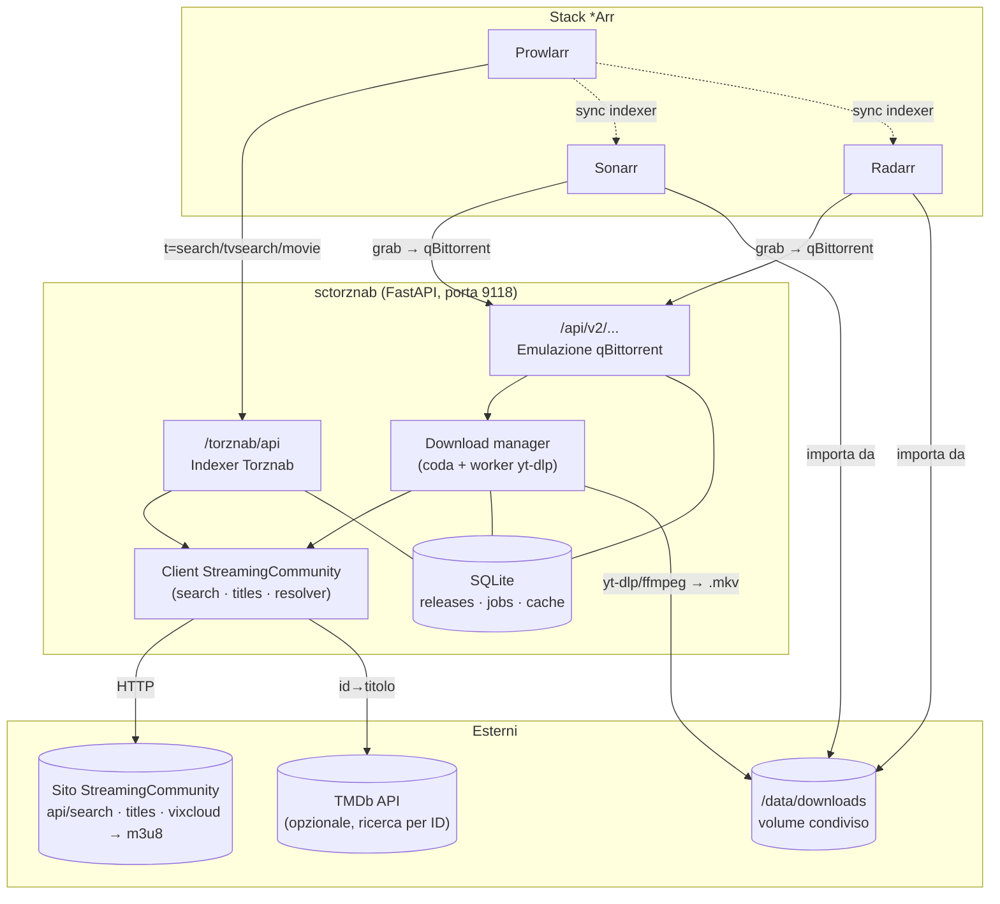
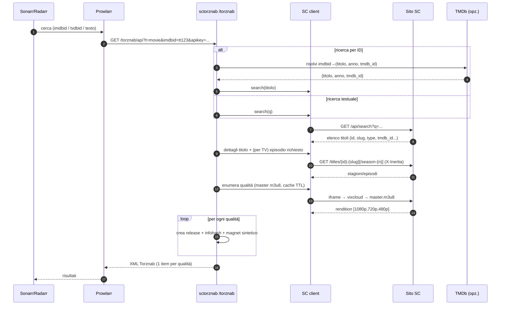
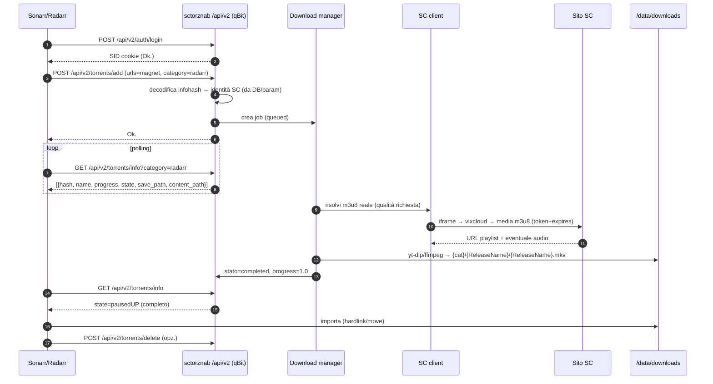
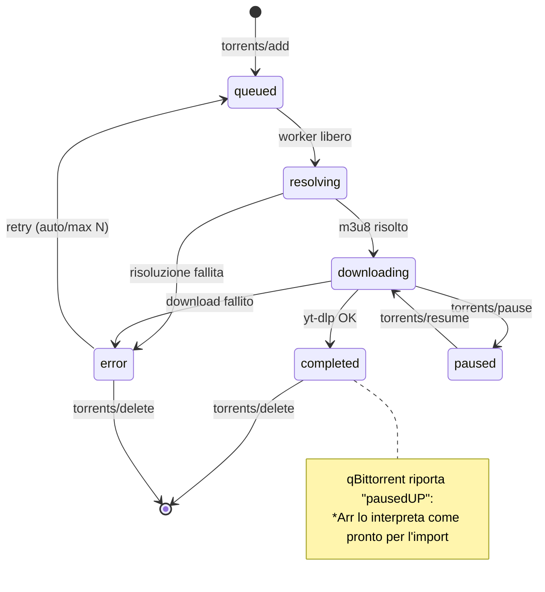
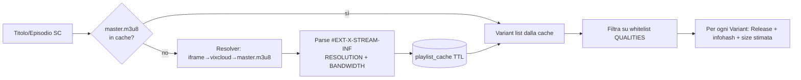
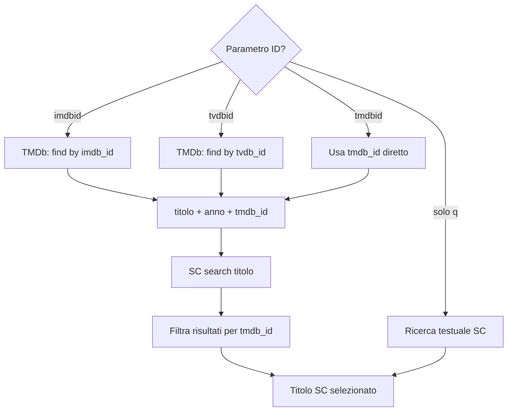
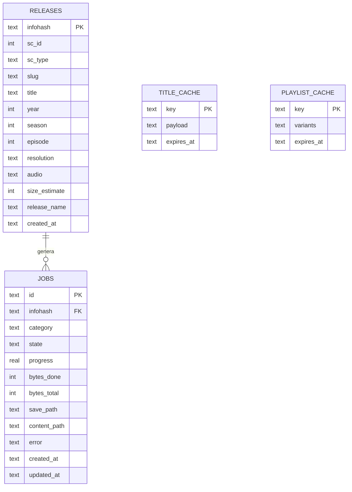
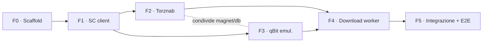

# ROADMAP — sctorznab

> Bridge in **Python (FastAPI + yt-dlp)** che espone un **indexer Torznab** per Prowlarr e un
> **download client compatibile qBittorrent** per Sonarr/Radarr. Poiché il sito fornisce solo
> stream **HLS (m3u8)** e non torrent reali, il servizio *finge* di essere qBittorrent ma internamente
> usa `yt-dlp`/`ffmpeg` per scaricare lo stream in un file `.mkv`. È lo stesso pattern collaudato da
> [`rdt-client`](https://github.com/rogerfar/rdt-client) per i servizi debrid.

- **Codename progetto:** `sctorznab`
- **Porta di default:** `9118`
- **Target:** Radarr (film) · Sonarr (serie TV) · Prowlarr (indexer)
- **Sito:** istanza tipo *StreamingCommunity* (accesso legale dichiarato), **senza autenticazione**

---

## Uso rapido

### Avvio con Docker Compose
1. Copia il file di esempio e personalizza almeno `SC_BASE_URL`, `PUBLIC_URL`, `TORZNAB_API_KEY` e i path sotto `/data`:
   ```bash
   cp .env.example .env
   ```
2. Avvia il servizio:
   ```bash
   docker compose up --build -d
   ```
3. Verifica che sia attivo:
   ```bash
   curl http://localhost:9118/health
   curl "http://localhost:9118/torznab/api?t=caps"
   ```

### Avvio locale
```bash
python -m venv .venv
source .venv/bin/activate
pip install -e ".[dev]"
cp .env.example .env
uvicorn app.main:app --host 0.0.0.0 --port 9118
```

### Configurazione in Prowlarr / Sonarr / Radarr
- **Prowlarr** → *Add Indexer* → *Generic Torznab*:
  - URL: `http://<host>:9118/torznab/api`
  - API Key: valore di `TORZNAB_API_KEY`
- **Sonarr / Radarr** → *Download Clients* → *qBittorrent*:
  - Host: `<host>`
  - Port: `9118`
  - Username / Password: `QBIT_USERNAME` / `QBIT_PASSWORD`
  - Category: `sonarr` oppure `radarr`

### Come funziona nell'uso quotidiano
1. Prowlarr interroga `/torznab/api` e riceve una release per ogni qualità disponibile.
2. Sonarr/Radarr inviano il magnet sintetico a `/api/v2/torrents/add`.
3. Il bridge risolve lo stream HLS e scarica il file finale in `DOWNLOAD_PATH/<category>/<release>/`.
4. Quando lo stato diventa completato, Sonarr/Radarr importano il file come se arrivasse da qBittorrent.

### Variabili minime consigliate
- `SC_BASE_URL`: dominio dell'istanza StreamingCommunity.
- `PUBLIC_URL`: URL pubblica usata nei link Torznab.
- `TORZNAB_API_KEY`: chiave usata da Prowlarr.
- `DOWNLOAD_PATH`: cartella condivisa con Sonarr/Radarr.
- `DB_PATH`: percorso del database SQLite persistente.

---

## 1. Obiettivi e requisiti

### 1.1 Requisiti funzionali
| ID | Requisito |
|----|-----------|
| RF-01 | Endpoint **Torznab** (`/torznab/api`) con `t=caps`, `t=search`, `t=tvsearch`, `t=movie`. |
| RF-02 | Ricerca **testuale** (`q`) **e per ID** (`imdbid`, `tmdbid`, `tvdbid`) — risoluzione via TMDb opzionale. |
| RF-03 | Per ogni titolo/episodio, **una release per ogni qualità** disponibile (es. 1080p, 720p, 480p). |
| RF-04 | Emulazione **API qBittorrent v2** sufficiente per Sonarr/Radarr (auth, add, info, delete, categorie). |
| RF-05 | Download **HLS→MKV** con `yt-dlp`/`ffmpeg`, con progress e denominazione *scene-style*. |
| RF-06 | File finale in `{DOWNLOAD_PATH}/{category}/{ReleaseName}/{ReleaseName}.mkv` importabile da *Arr. |
| RF-07 | Nessuna autenticazione verso il sito; hook di configurazione lasciato per estensioni future. |

### 1.2 Requisiti non funzionali
| ID | Requisito |
|----|-----------|
| RNF-01 | Deploy via **Docker + docker-compose**, volume `/data` condiviso con Sonarr/Radarr per hardlink. |
| RNF-02 | Ricerche veloci: **caching** di dominio, dettagli titolo e master-playlist con TTL. |
| RNF-03 | Resiliente al cambio di struttura API del sito: layer client isolato e configurabile. |
| RNF-04 | Idempotenza dei job (stesso `infohash` = stesso contenuto). |
| RNF-05 | Log strutturati e endpoint `/health`. |

### 1.3 Fuori scope (v1)
- UI web propria (si usano le UI di Sonarr/Radarr/Prowlarr).
- Muxing sottotitoli esterni, transcodifica, 4K/HDR.
- Seeding / ratio (non applicabile: non ci sono torrent reali).
- Gestione multi-utente / hardening auth avanzato.

---

## 2. Architettura



### 2.1 Componenti
| Componente | Responsabilità |
|-----------|----------------|
| **Torznab router** | Traduce le query Torznab in ricerche SC; costruisce feed XML/RSS con `torznab:attr`; emette una release per qualità. |
| **qBittorrent emulation** | Espone gli endpoint `/api/v2/*` richiesti da *Arr; accetta i "magnet" sintetici, crea job, riporta stato/progresso. |
| **SC client** | `search`, dettagli titolo (stagioni/episodi via header Inertia), resolver `iframe → vixcloud → master m3u8` con enumerazione delle rendition. |
| **Download manager** | Coda con N worker; ogni worker risolve l'm3u8 reale ed esegue `yt-dlp`/`ffmpeg`; aggiorna progress e stato. |
| **Naming** | Genera titoli *scene-style* per far riconoscere qualità/lingua a *Arr. |
| **Magnet/mapping** | `infohash` sintetico ↔ identità SC (id, stagione, episodio, risoluzione, audio). |
| **DB (SQLite)** | Tabelle `releases`, `jobs` e cache (`title_cache`, `playlist_cache`). |

---

## 3. Flussi

### 3.1 Flusso di ricerca


### 3.2 Flusso di grab + download


### 3.3 Ciclo di vita del job


---

## 4. Struttura del progetto

```text
sctorznab/
├── app/
│   ├── main.py                 # FastAPI: monta i router, /health, lifespan
│   ├── config.py               # Settings (pydantic-settings, env var)
│   ├── logging.py              # setup log strutturati
│   ├── db.py                   # engine SQLite + init schema + helpers
│   ├── models.py               # dataclass/pydantic: Release, Job, Title, Episode, Variant
│   ├── magnet.py               # infohash sintetico ↔ descrittore SC (encode/decode)
│   ├── sc/
│   │   ├── client.py           # httpx.AsyncClient, headers, dominio, retry, cache
│   │   ├── search.py           # GET /api/search → Title[]
│   │   ├── titles.py           # dettagli titolo, stagioni, episodi (X-Inertia)
│   │   └── resolver.py         # iframe → vixcloud → master m3u8 → Variant[] + media url
│   ├── torznab/
│   │   ├── router.py           # /torznab/api (dispatch su t=)
│   │   ├── caps.py             # XML capabilities
│   │   ├── feed.py             # costruzione <item> + torznab:attr
│   │   ├── naming.py           # nomi scene-style
│   │   └── categories.py       # mapping categorie Torznab
│   ├── qbit/
│   │   ├── router.py           # /api/v2/... (auth, torrents, app, transfer)
│   │   └── models.py           # strutture torrent list/info/properties
│   └── downloads/
│       ├── manager.py          # coda asyncio, stato, dispatch worker
│       ├── worker.py           # subprocess yt-dlp/ffmpeg + parsing progress
│       └── ytdlp.py            # costruzione comando, opzioni HLS
├── tests/
│   ├── test_sc_search.py
│   ├── test_resolver.py
│   ├── test_naming.py
│   ├── test_magnet.py
│   ├── test_torznab_caps.py
│   ├── test_torznab_feed.py
│   └── test_qbit_api.py
├── pyproject.toml
├── Dockerfile
├── docker-compose.yml
├── .env.example
├── .dockerignore
├── README.md
└── ROADMAP.md
```

---

## 5. API Torznab

### 5.1 Endpoint
`GET /torznab/api` con parametro `t`:

| `t` | Parametri principali | Note |
|-----|----------------------|------|
| `caps` | — | Ritorna capabilities XML. Nessun apikey richiesto. |
| `search` | `q`, `cat`, `limit`, `offset` | Ricerca libera. |
| `tvsearch` | `q`, `tvdbid`, `imdbid`, `season`, `ep`, `cat` | Serie TV. |
| `movie` | `q`, `imdbid`, `tmdbid`, `cat` | Film. |

Auth: `apikey` = `TORZNAB_API_KEY` (validato su tutte le funzioni tranne `caps`).

### 5.2 Esempio risposta `t=caps`
```xml
<?xml version="1.0" encoding="UTF-8"?>
<caps>
  <server version="1.1" title="sctorznab" strapline="StreamingCommunity bridge"/>
  <limits max="100" default="50"/>
  <searching>
    <search available="yes" supportedParams="q"/>
    <tv-search available="yes" supportedParams="q,tvdbid,imdbid,season,ep"/>
    <movie-search available="yes" supportedParams="q,imdbid,tmdbid"/>
  </searching>
  <categories>
    <category id="2000" name="Movies">
      <subcat id="2030" name="SD"/>
      <subcat id="2040" name="HD"/>
      <subcat id="2045" name="UHD"/>
    </category>
    <category id="5000" name="TV">
      <subcat id="5030" name="SD"/>
      <subcat id="5040" name="HD"/>
      <subcat id="5045" name="UHD"/>
    </category>
  </categories>
</caps>
```

### 5.3 Esempio `<item>` (una release per qualità)
```xml
<item>
  <title>Nome.Film.2021.1080p.WEB-DL.H264.ITA-SC</title>
  <guid>a1b2c3...deterministico...f9</guid>
  <link>http://HOST:9118/dl/a1b2c3...f9.torrent</link>
  <enclosure url="magnet:?xt=urn:btih:a1b2c3...f9&amp;dn=Nome.Film..." type="application/x-bittorrent"/>
  <size>2576980377</size>
  <pubDate>Wed, 27 Aug 2025 12:00:00 +0000</pubDate>
  <torznab:attr name="category" value="2040"/>
  <torznab:attr name="seeders" value="100"/>
  <torznab:attr name="peers" value="100"/>
  <torznab:attr name="magneturl" value="magnet:?xt=urn:btih:a1b2c3...f9"/>
  <torznab:attr name="infohash" value="a1b2c3...f9"/>
</item>
```

> **Seeders/peers fittizi ma alti** (es. 100/100): Sonarr/Radarr scartano release con 0 seeder.
> Il `downloadvolumefactor=0` / `uploadvolumefactor=1` possono essere aggiunti per marcare "freeleech".

---

## 6. Una release per qualità (RF-03)



- Le rendition si ricavano dal **master playlist** (`#EXT-X-STREAM-INF:RESOLUTION=1920x1080,BANDWIDTH=...`).
- **Size stimata** = `BANDWIDTH (bit/s) × durata (s) / 8` → valore plausibile per i quality profile di *Arr.
- **Cache** `playlist_cache` con TTL (es. 6h) per non risolibere ad ogni ricerca/grab.
- **Performance:** per ricerche testuali multi-risultato, la risoluzione del master playlist è limitata ai
  primi *N* titoli; oltre, si usa la **whitelist `QUALITIES`** come fallback (release emesse senza probe).
- Ogni qualità ha un `infohash` distinto → `sha1(f"{sc_id}:{season}:{ep}:{resolution}:{audio}")`.

---

## 7. Emulazione qBittorrent (v2 WebUI API)

Endpoint minimi richiesti da Sonarr/Radarr (basati su rdt-client e sull'API ufficiale qBittorrent):

| Metodo | Endpoint | Scopo |
|--------|----------|-------|
| GET | `/api/v2/app/version` | Versione fittizia (es. `v4.6.0`). |
| GET | `/api/v2/app/webapiVersion` | Es. `2.9.2`. |
| GET | `/api/v2/app/preferences` | JSON con `save_path`, ecc. |
| POST | `/api/v2/auth/login` | Setta cookie `SID`, ritorna `Ok.`. |
| GET | `/api/v2/torrents/info` | Lista torrent (filtrata per `category`). |
| GET | `/api/v2/torrents/properties` | Dettagli per `hash`. |
| GET | `/api/v2/torrents/files` | File del torrent. |
| GET | `/api/v2/torrents/categories` | Categorie note. |
| POST | `/api/v2/torrents/createCategory` | Crea categoria (`sonarr`/`radarr`). |
| POST | `/api/v2/torrents/setCategory` | Assegna categoria. |
| POST | `/api/v2/torrents/add` | Aggiunge "torrent" (magnet/URL) → crea job. |
| POST | `/api/v2/torrents/delete` | Rimuove job (+ file opz.). |
| POST | `/api/v2/torrents/pause` · `resume` | Pausa/riprende job. |
| POST | `/api/v2/torrents/setShareLimits` · `topPrio` | **Stub** `200 OK`. |
| GET | `/api/v2/transfer/*` | **Stub** (valori a zero). |

**Campi chiave in `torrents/info`:** `hash`, `name`, `size`, `progress` (0–1), `state`
(`downloading`/`pausedUP`/`error`), `save_path`, `content_path`, `category`, `dlspeed`, `eta`, `amount_left`.

> Nota: progress ed ETA in *Arr non saranno accuratissimi, ma il torrent verrà segnalato come completato
> e quindi importato — comportamento identico a rdt-client.

---

## 8. Client StreamingCommunity (reverse-engineering)

> ⚠️ **Struttura tipica da verificare sull'istanza reale** — gli endpoint SC cambiano tra versioni.

| Passo | Richiesta (tipica) | Risposta |
|-------|--------------------|----------|
| Dominio | `GET /` o config `SC_BASE_URL` | dominio attivo. |
| Ricerca | `GET /api/search?q={query}` | `{ data: [ {id, slug, name, type: movie\|tv, score, images, tmdb_id, last_air_date} ] }` |
| Dettagli titolo | `GET /titles/{id}-{slug}` header `X-Inertia: true` | props con stagioni (per TV) / metadati film. |
| Episodi stagione | `GET /titles/{id}-{slug}/season-{n}` (X-Inertia) | episodi `{id, number, name}`. |
| Playback | `GET /iframe/{id}?episode_id={eid}` → embed **vixcloud/scws** | URL master `.m3u8` con `token`+`expires`. |
| Master playlist | `GET {master.m3u8}` | `#EXT-X-STREAM-INF` (rendition) + eventuali tracce audio. |

**Note d'implementazione**
- `httpx.AsyncClient` con `User-Agent` browser-like, timeout, retry con backoff.
- Nessuna autenticazione (RF-07); lasciare hook `SC_COOKIE`/`SC_TOKEN` non usati per estensioni.
- Isolare i selettori/percorsi in `sc/` per adattarli rapidamente se il sito cambia.
- Cache: `title_cache` (dettagli titolo) + `playlist_cache` (rendition) con TTL.

---

## 9. Denominazione *scene-style* (naming)

**Template**
- Film: `{Titolo}.{Anno}.{Res}p.WEB-DL.{VCodec}.{Audio}-SC`
- Serie: `{Titolo}.S{ss:02}E{ee:02}.{Res}p.WEB-DL.{VCodec}.{Audio}-SC`

| Elemento | Origine | Esempio |
|----------|---------|---------|
| Titolo | SC (normalizzato: spazi→`.`, rimozione caratteri) | `Il.Signore.Degli.Anelli` |
| Anno | SC / TMDb | `2001` |
| Res | rendition master playlist | `1080` |
| Source | fisso | `WEB-DL` |
| VCodec | da BANDWIDTH/CODECS (`avc1`→`H264`) | `H264` |
| Audio | lingua/e disponibili | `ITA`, `ITA.ENG`→`MULTi` |
| Group | fisso | `SC` |

**Esempi**
- `Dune.2021.2160p.WEB-DL.H265.ITA-SC`
- `Breaking.Bad.S03E07.720p.WEB-DL.H264.MULTi-SC`

> Il naming è **critico**: *Arr estrae qualità/risoluzione/lingua dal titolo per matchare i quality profile.

### 9.1 Mapping categorie
| Contenuto | Risoluzione | Categoria Torznab |
|-----------|-------------|-------------------|
| Film | <720p | 2030 (Movies/SD) |
| Film | 720–1080p | 2040 (Movies/HD) |
| Film | ≥2160p | 2045 (Movies/UHD) |
| TV | <720p | 5030 (TV/SD) |
| TV | 720–1080p | 5040 (TV/HD) |
| TV | ≥2160p | 5045 (TV/UHD) |

---

## 10. Ricerca per ID (RF-02)



- `TMDB_API_KEY` **opzionale**: se assente, la ricerca per ID ricade sul testo (`q`) fornito comunque da Prowlarr.
- Gli item SC espongono `tmdb_id` → match affidabile dopo la ricerca testuale.

---

## 11. Configurazione (env var)

| Variabile | Default | Descrizione |
|-----------|---------|-------------|
| `SC_BASE_URL` | — | URL base del sito (es. `https://streamingcommunityz.studio`). |
| `PUBLIC_URL` | `http://localhost:9118` | URL pubblico del servizio (per i link nel feed). |
| `PORT` | `9118` | Porta HTTP. |
| `TORZNAB_API_KEY` | *(random al primo avvio)* | API key richiesta da Prowlarr. |
| `QBIT_USERNAME` | `admin` | Utente per il login qBittorrent emulato. |
| `QBIT_PASSWORD` | `adminadmin` | Password. |
| `DOWNLOAD_PATH` | `/data/downloads` | Root download (condivisa con *Arr). |
| `QUALITIES` | `1080,720,480` | Whitelist qualità per le release. |
| `PREFERRED_AUDIO` | `ita,eng` | Ordine lingue audio preferite. |
| `RELEASE_GROUP` | `SC` | Suffisso gruppo nei nomi release. |
| `TMDB_API_KEY` | *(vuoto)* | Opzionale: ricerca per ID. |
| `MAX_CONCURRENT_DOWNLOADS` | `2` | Worker paralleli. |
| `PLAYLIST_CACHE_TTL` | `21600` | TTL cache rendition (s). |
| `YTDLP_PATH` / `FFMPEG_PATH` | `yt-dlp`/`ffmpeg` | Percorsi binari. |
| `DB_PATH` | `/data/db/sctorznab.db` | File SQLite. |
| `LOG_LEVEL` | `INFO` | Livello log. |
| `USER_AGENT` | *(browser-like)* | UA per le richieste al sito. |

---

## 12. Schema dati (SQLite)



- `releases` viene **upsert** alla costruzione del feed (così il grab può risolvere l'`infohash`).
- `jobs` traccia il download; `state` guida la risposta di `torrents/info`.

---

## 13. Download worker

- Comando base (esempio) — HLS con `yt-dlp` + `ffmpeg` per il mux:
  ```
  yt-dlp --no-part --newline \
         --hls-use-mpegts \
         -f "bv*[height=<RES>]+ba/b[height=<RES>]" \
         -o "{DOWNLOAD_PATH}/{cat}/{ReleaseName}/{ReleaseName}.%(ext)s" \
         "<master_or_media_m3u8>"
  ```
- **Progress:** parsing dello stdout `--newline` (percentuale, ETA, velocità) → aggiornamento `jobs`.
- **Selezione qualità:** si forza l'altezza corrispondente alla release grabbata; fallback alla più vicina.
- **Audio/lingua:** se il sito espone tracce multiple, selezione secondo `PREFERRED_AUDIO`.
- **Atomicità:** download in cartella temporanea, poi move/rename a completamento.
- **Retry:** fino a *N* tentativi su errore transitorio (token m3u8 scaduto → ri-risoluzione).

---

## 14. Deploy (Docker)

**`Dockerfile`** (schema):
```dockerfile
FROM python:3.12-slim
RUN apt-get update && apt-get install -y --no-install-recommends ffmpeg \
    && rm -rf /var/lib/apt/lists/*
WORKDIR /app
COPY pyproject.toml .
RUN pip install --no-cache-dir .
COPY app ./app
EXPOSE 9118
CMD ["uvicorn", "app.main:app", "--host", "0.0.0.0", "--port", "9118"]
```

**`docker-compose.yml`** (estratto):
```yaml
services:
  sctorznab:
    build: .
    container_name: sctorznab
    ports: ["9118:9118"]
    environment:
      - SC_BASE_URL=https://streamingcommunityz.studio
      - PUBLIC_URL=http://sctorznab:9118
      - TORZNAB_API_KEY=change-me
    volumes:
      - /path/media/data:/data      # STESSO mount di Sonarr/Radarr (hardlink)
    restart: unless-stopped
```

> **Path mapping:** `DOWNLOAD_PATH` deve risolvere alla **stessa cartella fisica** vista da Sonarr/Radarr
> per permettere hardlink/atomic-move durante l'import.

### 14.1 Wiring in *Arr
- **Prowlarr →** Add Indexer → *Generic Torznab*: URL `http://sctorznab:9118/torznab/api`, API Key = `TORZNAB_API_KEY`.
- **Sonarr/Radarr →** Settings → Download Clients → *qBittorrent*: host `sctorznab`, porta `9118`,
  user/pass = `QBIT_*`, categoria `sonarr`/`radarr`.

---

## 15. Fasi implementative



### F0 — Scaffold del progetto
- [ ] `pyproject.toml` (fastapi, uvicorn, httpx, pydantic-settings, yt-dlp), layout `app/`.
- [ ] `config.py`, `logging.py`, `main.py` con `/health`.
- [ ] `Dockerfile`, `docker-compose.yml`, `.env.example`, `.dockerignore`.

### F1 — Client StreamingCommunity  *(blocca F2, F4)*
- [ ] `sc/client.py` (httpx, headers, retry, cache).
- [ ] `sc/search.py` → `Title[]`.
- [ ] `sc/titles.py` → stagioni/episodi (X-Inertia).
- [ ] `sc/resolver.py` → master m3u8 + `Variant[]` + media url.
- [ ] Test con httpx mockato.

### F2 — Indexer Torznab  *(dopo F1; parallelo a F3)*
- [ ] `torznab/caps.py`, `categories.py`, `naming.py`.
- [ ] `torznab/feed.py` (una release per qualità, size stimata, `torznab:attr`).
- [ ] `torznab/router.py` (`search`/`tvsearch`/`movie`, ricerca per ID + TMDb opz.).
- [ ] `magnet.py` (encode/decode infohash).
- [ ] Test caps + feed + naming + magnet.

### F3 — Emulazione qBittorrent  *(parallelo a F2)*
- [ ] `qbit/router.py` (auth, app, torrents info/add/delete/categories, stub transfer).
- [ ] `qbit/models.py` (mappa `Job` → payload qBit).
- [ ] Test API con client HTTP.

### F4 — Download worker  *(dopo F1 e F3)*
- [ ] `downloads/manager.py` (coda asyncio, stato, retry).
- [ ] `downloads/worker.py` + `ytdlp.py` (subprocess, progress, atomic move).
- [ ] Job persistiti su DB; integrazione con `torrents/info`.

### F5 — Integrazione & verifica E2E
- [ ] docker-compose completo; wiring Prowlarr/Sonarr/Radarr.
- [ ] Test end-to-end su un titolo reale.
- [ ] `README.md` con setup passo-passo.

---

## 16. Piano di verifica

| # | Verifica | Esito atteso |
|---|----------|--------------|
| 1 | `curl /health` | `200 OK`. |
| 2 | `curl "/torznab/api?t=caps"` | XML capabilities valido. |
| 3 | Prowlarr → Generic Torznab → **Test** | Verde. |
| 4 | Ricerca in Prowlarr (film noto) | ≥1 item per qualità. |
| 5 | Sonarr/Radarr → qBittorrent → **Test** | Verde. |
| 6 | Grab manuale di una release | Job creato, `state=downloading`. |
| 7 | Completamento download | File `.mkv` in `{cat}/{ReleaseName}/`. |
| 8 | Import *Arr | File importato (hardlink/move). |
| 9 | `pytest` | Suite verde (client, naming, magnet, caps, feed, qbit). |

---

## 17. Rischi e mitigazioni

| Rischio | Impatto | Mitigazione |
|---------|---------|-------------|
| Il sito cambia struttura API | Rotture ricerca/resolver | Layer `sc/` isolato + config; test di contratto; log chiari. |
| Token m3u8 scaduto durante il download | Download fallito | Ri-risoluzione al retry; risoluzione *just-in-time* nel worker. |
| Ricerche lente (probe master playlist) | Timeout Prowlarr | Cache TTL + limite probe su N titoli + fallback whitelist `QUALITIES`. |
| Size stimata imprecisa | Scelte quality profile errate | Stima da BANDWIDTH×durata; marcare freeleech. |
| Path mapping errato | Import *Arr fallito | Volume `/data` identico tra i container; doc esplicita. |
| Rate limiting del sito | Ban/errori | Backoff, UA realistico, `MAX_CONCURRENT_DOWNLOADS` basso. |

---

## 18. Note legali e di sicurezza
- Usare esclusivamente per contenuti a cui si ha **accesso legittimo** (dichiarato dall'utente); rispettare i ToS del servizio.
- Nessun credenziale hardcoded: `TORZNAB_API_KEY` e `QBIT_PASSWORD` da env; generare API key random se assente.
- Validazione input sugli endpoint (parametri Torznab e qBit) per evitare injection/percorsi arbitrari.
- Il servizio è pensato per rete **privata/homelab**; non esporlo pubblicamente senza reverse proxy + auth.

---

## 19. Estensioni future (post-v1)
- Sottotitoli esterni (download + mux o file `.srt` affiancato).
- Endpoint SABnzbd emulato (alternativa Usenet-style).
- Selezione traccia audio avanzata / release `MULTi` esplicite.
- Metrica Prometheus + dashboard.
- Supporto a più fonti/siti tramite provider plug-in.
